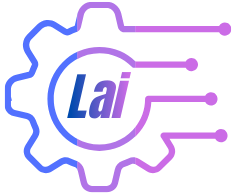
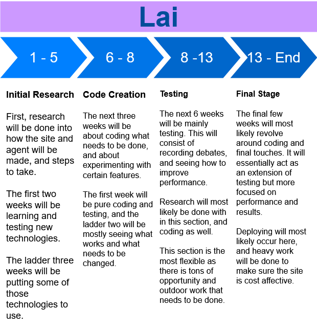

  

# 🤖 Lai

**The AI powered Lie detector!**

If you wish to contact me for anything related to this project, feel free to reach out via [Email](mailto:dr507498@gmail.com), [LinkedIn](https://www.linkedin.com/in/david-rodriguez-nyc/) or open an issue on GitHub.

  
Table of Contents

  
- [🤖 Lai](#-lai)
  - [Introduction](#introduction)
    - [Timeline](#timeline)
  - [Features](#features)
    - [Built With](#built-with)
  - [Getting Started](#getting-started)
    - [Prerequisites](#prerequisites)
    - [Setup](#setup)
  - [Demo](#demo)
    - [Demonstration Videos](#demonstration-videos)
      - [Demo 1: TBD](#demo-1-tbd)
      - [Demo 2: TBD](#demo-2-tbd)
  - [Contributing](#contributing)
  - [License](#license)

## Introduction
***To create a world where people on an influential platform can not lie to the world.***

An AI powered Lie Detector, that fact checks statements in real time!

**About the Creator**

* **Name:** David Rodriguez
* **College:** Brooklyn College
* **Year:** Senior
* **Extracurricular Activities:**
    * Undergraduate Student Government Senator
    * Former CodePath Ambassador
    * Club Treasurer

### Timeline
Image of the projected project timeline.

  

## Features

### Built With
The following technologies were utilized to build the Lai assistant:

* **Language**
    - 

* **AI & Logic**
    - 
    - 

* **Tools & Voice**
    - 
    - 

* **UI**
    - 

<a href="#readme-top">Back to top</a>

## Getting Started
tbd

### Prerequisites
tbd

### Setup
tbd

## Demo
In order to demonstrate the capabilities of Lai, various debates and usage example were/will be recorded and can be found in the repository under the `docs/assets/demo/` folder.

### Demonstration Videos
Each of the following demonstration videos will show not only the current capability of the AI tool, but also show people's live reaction and thoughts of the process, and the results.

#### Demo 1: TBD
tbd

Video Link: [TBD]()

#### Demo 2: TBD
tbd

Video Link: [TBD]()

<a href="#readme-top">Back to top</a>

## Contributing
Contributions to this repository are welcome! If you wish to contribute, please follow the guidelines below.

Heres how you can contribute:
1. Fork the repository
2. Create a new feature branch
3. Commit your changes
4. Push to the branch
5. Submit a pull request

## License
This project is licensed under the Apache 2.0 License - see the [LICENSE](https://github.com/drod75/Lai/blob/main/LICENSE) file for details.

